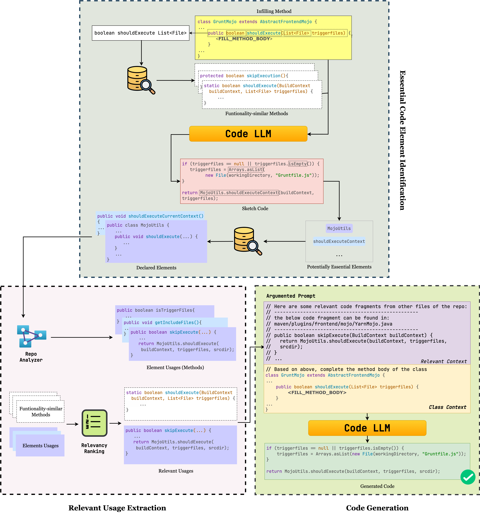

<div align="center">

# RAMBO: Enhancing RAG-based Repository-Level Method Body Completion
[](https://opensource.org/licenses/MIT) [](https://www.python.org/downloads/release/python-380/) [](https://arxiv.org/abs/2409.15204v1)
</div>

## Introduction

In this paper, we introduce RAMBO, a novel RAG-based approach for repository-level MBC. Instead of retrieving similar method bodies, RAMBO identifies essential repositoryspecific elements, such as classes, methods, and variables/fields, and their relevant usages. By incorporating these elements and their relevant usages into the code generation process, RAMBO ensures more accurate and contextually relevant method bodies.

Our experimental results with leading code LLMs across 40 Java projects show that RAMBO significantly outperformed the state-of-the-art repository-level MBC approaches, with the improvements of up to 46% in BLEU, 57% in CodeBLEU, 36% in Compilation Rate, and up to 3X in Exact Match. Notably, RAMBO surpassed RepoCoder Oracle method by up to 12% in Exact Match, setting a new  benchmark for repository-level MBC.

#### Paper: https://arxiv.org/abs/2409.15204v1

## The architecture


In RAMBO, procedure retrieve consists of two main steps,
*Essential Code Element Identification (EEI)* and *Relevant Usage Extraction (RUE)*. For the given infilling method m in repo R, *EEI* identifies the repo-specific essential code elements (e.g., methods, attributes, or types) as “materials” to form m’s body. After that, *RUE* extracts these elements’ usages (i.e., the methods using those elements)
as “recipes” of these materials to form the method body
and then ranks these usages based on the relevancy to m. Then, the identified essential elements and their relevant usages are utilized to construct the context before feeding it into a CodeLLM to generate method body.

# Project Overview

# Quickstart
## Download dataset

[Download full repository here](https://www.dropbox.com/scl/fo/zgn1s3ad8lhxwi4n8pn06/AHQ2o8AzYIFpCLIIyYuoH48?rlkey=cx1emxzccyhurcajva5a6gnrg&st=zk5qdsn7&dl=0)

## Prepare Environment
First, we should set up a python environment. This code base has been tested under python 3.8.

```bash
$ conda create -n rambo python=3.8
$ conda activate rambo
$ pip install -r requirements.txt
```

# Citation
If you're using RAMBO in your research or applications, please consider citing our paper:
```bibtex
@article{bui2024rambo,
  title={RAMBO: Enhancing RAG-based Repository-Level Method Body Completion},
  author={Bui, Tuan-Dung and Luu-Van, Duc-Thieu and Nguyen, Thanh-Phat and Nguyen, Thu-Trang and Nguyen, Son and Vo, Hieu Dinh},
  journal={arXiv preprint arXiv:2409.15204},
  year={2024}
}
```

# Contact us
If you have any questions, comments or suggestions, please do not hesitate to contact us.
- Email: 21020006@vnu.edu.vn

# License
[MIT License](LICENSE)
